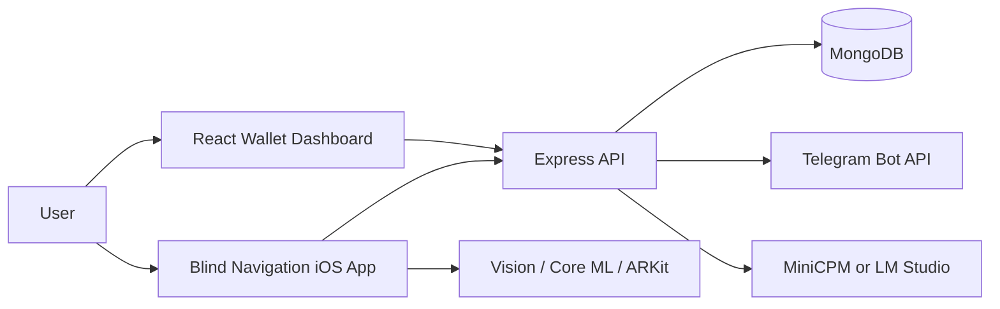
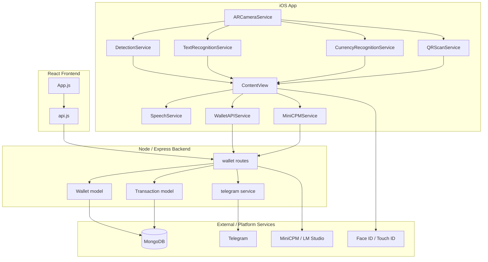
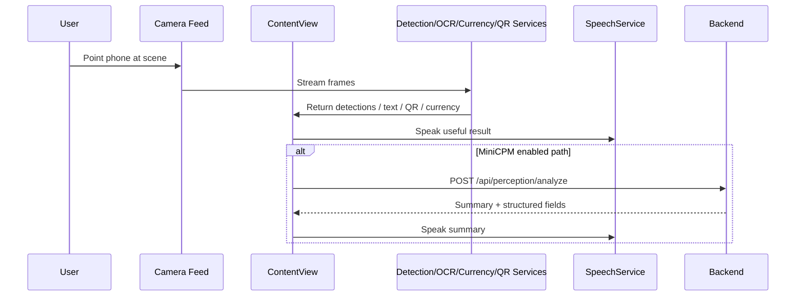
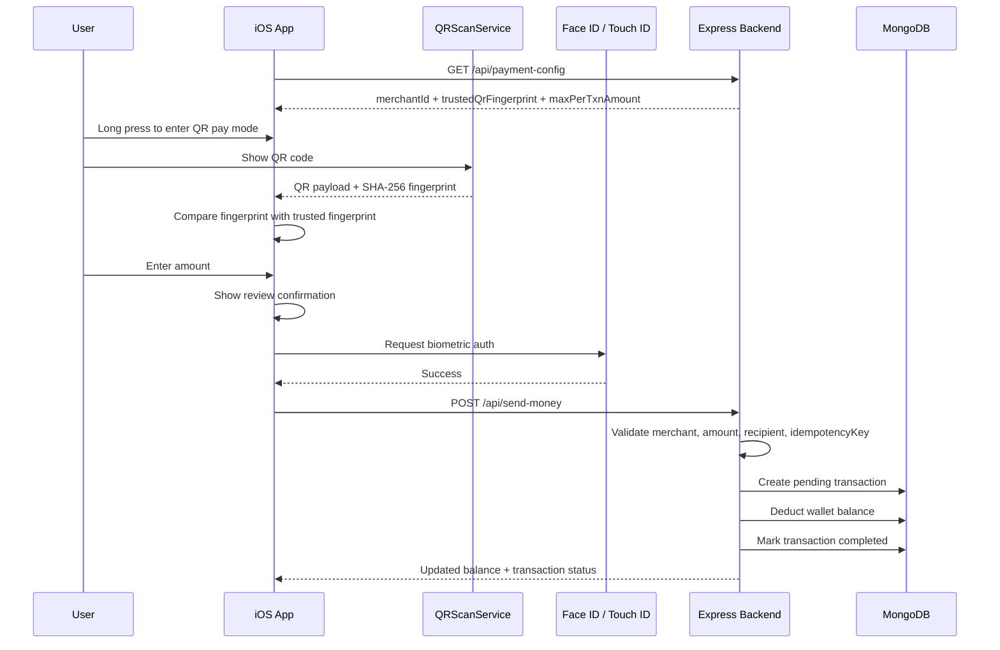
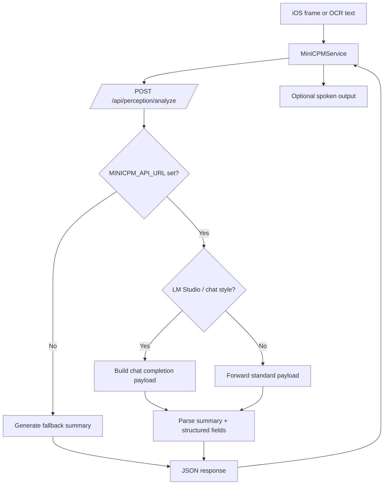
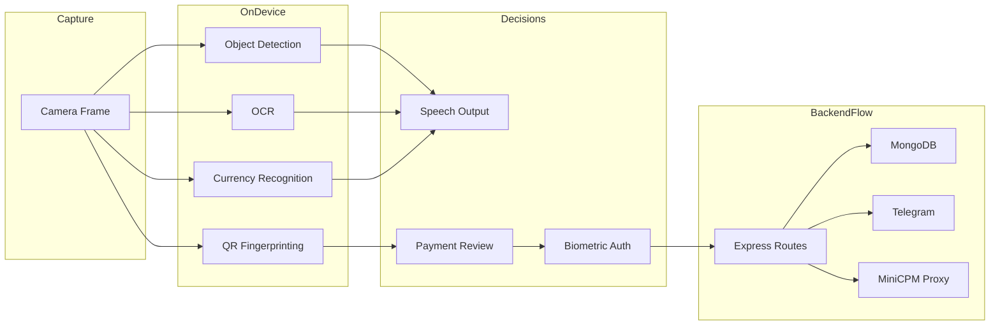

# Voice Vision

Voice Vision is a two-part project:

1. A web wallet that stores money, shows balance, and records transactions.
2. An iPhone app that helps a blind or low-vision user understand what is in front of them and make a safe QR payment.

The important idea is simple:

- The phone camera looks at the world.
- The app tries to understand what it sees.
- The app speaks useful information aloud.
- If the user wants to pay, the app only allows payment to one trusted merchant configured by the backend.
- The wallet backend keeps the balance, saves the transaction, and can send a Telegram notification.

## What This Project Does

This project combines accessibility and payments.

The **Blind Navigation** iOS app helps a user:

- detect objects around them
- read visible text
- recognize Indian currency notes
- scan a QR code
- hear spoken guidance
- use Face ID or Touch ID before a payment is sent

The **Digital Wallet** web app and backend help by:

- storing wallet balance
- adding funds
- sending money to a trusted merchant
- showing transaction history
- exposing APIs the iPhone app can call
- optionally forwarding transaction alerts to Telegram
- optionally proxying MiniCPM-based scene and document understanding

## In Simple Human Language

Imagine one person using their phone as an assistant.

When they point the phone camera at the world, the app can say things like:

- "person ahead"
- "chair"
- "text detected"
- "100 rupees"

If they switch to payment mode and point the phone at a trusted QR code:

1. the app checks whether that QR code matches the trusted one
2. the user enters an amount
3. the app asks the user to review the payment
4. the app asks for Face ID or Touch ID
5. the backend removes money from the wallet and stores the transaction

So the project is not just "camera vision" and not just "wallet payments". It is a connected system where computer vision, voice feedback, and a guarded payment flow work together.

## How It Does That

At a high level:

- The iOS app uses Apple frameworks like `Vision`, `Core ML`, `ARKit`, and `AVFoundation`.
- The app runs different recognition services depending on the active mode.
- The backend is an `Express` server connected to `MongoDB`.
- The React frontend shows wallet balance and transaction history.
- The backend exposes payment and perception APIs used by both the web app and the iOS app.

## Repository Layout

```text
voice-vision/
├── backend/                    # Node.js + Express API
├── frontend/                   # React wallet dashboard
├── blind-navigation/           # SwiftUI iOS app
├── digital-wallet/README.md    # Wallet-specific docs
├── blind-navigation/README.md  # iOS app-specific docs
├── TROUBLESHOOTING.md
└── README.md                   # Root overview
```

## Main User Experiences

### 1. Camera Assistance

The app can describe the scene and read text aloud.

- Object detection uses a YOLO Core ML model.
- Text recognition uses Apple's Vision OCR APIs.
- AR data is used for walls, windows, and doorway cues.
- Speech output tells the user what matters most.

### 2. Currency Recognition

The app can switch into a dedicated rupee-note mode.

- It uses a custom Indian currency model.
- It also uses OCR to look for rupee symbols and denomination numbers.
- It combines these signals to reduce mistakes.

### 3. QR Payments

The app can switch into a QR payment mode.

- It scans QR data from the camera feed.
- It fingerprints the QR payload.
- It compares that fingerprint with the trusted fingerprint from the backend.
- It asks for amount entry and review.
- It requires biometric confirmation.
- It sends the transaction to the wallet backend with an idempotency key.

### 4. Wallet Dashboard

The web dashboard gives a simple operator view.

- current balance
- add funds
- send money
- recent transactions
- trusted merchant configuration loaded from backend

## Simple System Picture



## Project Components

### Blind Navigation iOS App

Primary responsibilities:

- camera capture
- object detection
- OCR
- scene/document understanding
- currency recognition
- QR scanning
- speech feedback
- biometric payment approval

Important files:

- `blind-navigation/blind-navigation/ContentView.swift`
- `blind-navigation/blind-navigation/DetectionService.swift`
- `blind-navigation/blind-navigation/TextRecognitionService.swift`
- `blind-navigation/blind-navigation/CurrencyRecognitionService.swift`
- `blind-navigation/blind-navigation/QRScanService.swift`
- `blind-navigation/blind-navigation/WalletAPIService.swift`

### Digital Wallet Backend

Primary responsibilities:

- initialize and return wallet balance
- accept deposits
- execute trusted-merchant withdrawals
- enforce idempotency
- save transaction records
- provide payment configuration to clients
- proxy MiniCPM perception requests

Important files:

- `backend/server.js`
- `backend/routes/wallet.js`
- `backend/models/Wallet.js`
- `backend/models/Transaction.js`
- `backend/services/telegram.js`

### Digital Wallet Frontend

Primary responsibilities:

- display balance
- show transaction list
- collect add-funds input
- collect send-money input
- poll backend for fresh state

Important files:

- `frontend/src/App.js`
- `frontend/src/services/api.js`
- `frontend/src/components/WalletCard.js`
- `frontend/src/components/TransactionHistory.js`
- `frontend/src/components/AddFundsModal.js`
- `frontend/src/components/SendMoneyModal.js`

---

## Technical Deep Dive

The rest of this README is for someone who wants to understand how the system is wired internally.

## Architecture



## Mode Model Inside the iOS App

The iOS app is effectively a mode-driven vision client.

### Default Mode

Active behavior:

- object detection
- OCR
- AR overlays
- spoken scene cues
- MiniCPM mode toggle for `scene`, `read`, and `document`

### Currency Mode

Activated by double tap.

Active behavior:

- rupee-note recognition only
- flashlight support
- object detection and QR payment flow disabled

### QR Payment Mode

Activated by long press.

Active behavior:

- QR scanning only
- trusted fingerprint matching
- amount entry
- review prompt
- biometric verification
- backend payment submission

## iOS Processing Flow



## QR Payment Flow

This is the most important cross-project integration in the repo.

### Security Intent

The code is intentionally restrictive:

- one trusted merchant
- one trusted QR fingerprint
- max per-transaction amount
- biometric confirmation
- idempotency on backend

### End-to-End Payment Flow



## Backend API Design

The backend lives in `backend/server.js` and `backend/routes/wallet.js`.

### Core Endpoints

| Method | Route | Purpose |
|---|---|---|
| `GET` | `/api/balance` | Return current wallet balance |
| `POST` | `/api/add-funds` | Deposit money into wallet |
| `GET` | `/api/payment-config` | Return trusted merchant + QR fingerprint config |
| `POST` | `/api/send-money` | Execute a guarded withdrawal |
| `GET` | `/api/transactions` | Return transaction history |
| `POST` | `/api/perception/analyze` | Proxy MiniCPM scene/read/document analysis |
| `GET` | `/api/telegram-test` | Test Telegram notifications |

### Wallet Data Model

`Wallet`:

- single balance field
- created automatically if missing

`Transaction`:

- `type`: `deposit` or `withdrawal`
- `amount`
- `description`
- `recipientPhone`
- `merchantId`
- `merchantDisplayName`
- `idempotencyKey`
- `authMethod`
- `status`
- `failureReason`
- timestamps

There is a unique sparse index on `idempotencyKey`, which allows safe retries for payments.

## Backend Payment Validation Rules

When `POST /api/send-money` is called, the backend:

1. validates the amount
2. checks the max-per-transaction limit
3. checks the merchant ID
4. optionally checks recipient phone if one is sent
5. requires an `idempotencyKey`
6. replays the previous result if that same key was already used
7. creates a pending transaction
8. checks wallet balance
9. marks the transaction as failed if balance is insufficient
10. deducts balance and marks the transaction as completed if valid

## Perception Proxy Design

The project includes a backend perception endpoint as a compatibility fallback when the iOS app cannot execute MiniCPM on-device.

Benefits:

- compatibility/debug fallback for devices without a local runtime
- easier environment configuration
- fallback behavior when the model endpoint is unavailable
- support for scene mode, read mode, and document mode

### Perception Request Flow



## Frontend Behavior

The React frontend is intentionally simple.

`frontend/src/App.js`:

- loads balance, transactions, and payment config on startup
- refreshes every 2 seconds
- opens add-funds and send-money modals
- reloads state after successful actions

`frontend/src/services/api.js`:

- points to `REACT_APP_API_URL` or `http://localhost:5001/api`
- generates a web idempotency key for send-money requests
- wraps all API calls in a small axios client

## Data Flow Summary



## Setup

### Prerequisites

For the backend and frontend:

- Node.js
- npm
- MongoDB

For the iOS app:

- macOS
- Xcode
- iOS 17+ target device or simulator

### Backend

```bash
cd backend
npm install
npm start
```

Default backend URL:

- `http://localhost:5001`

### Frontend

```bash
cd frontend
npm install
npm start
```

Default frontend URL:

- `http://localhost:3000`

### iOS App

```bash
cd blind-navigation
open blind-navigation.xcodeproj
```

If running on a physical device, update the LAN IP in `blind-navigation/blind-navigation/BackendConfig.swift` if needed.

## Environment Variables

Backend configuration is driven mainly by `.env`.

```env
PORT=5001
MONGODB_URI=mongodb://localhost:27017/digital-wallet

TELEGRAM_BOT_TOKEN=
TELEGRAM_CHAT_ID=

PAYMENT_MERCHANT_ID=voicevision-demo-merchant
PAYMENT_MERCHANT_NAME=VoiceVision Demo Merchant
PAYMENT_RECIPIENT_PHONE=8290883601
PAYMENT_TRUSTED_QR_RAW=https://en.m.wikipedia.org
PAYMENT_MAX_PER_TXN=5000

MINICPM_API_URL=http://127.0.0.1:1234/v1/chat/completions
MINICPM_API_KEY=
MINICPM_TIMEOUT_MS=15000
MINICPM_PROVIDER=lmstudio
MINICPM_MODEL=mini-cpm-v-4
MINICPM_TEMPERATURE=0.2
MINICPM_MAX_TOKENS=350
```

## Operational Notes

### Telegram

Telegram notifications are optional.

If `TELEGRAM_BOT_TOKEN` and `TELEGRAM_CHAT_ID` are missing, the app still works. It simply skips sending alerts.

### Database Model Choice

The backend currently uses a single wallet record and a transaction collection. That keeps the demo simple, but it also means this is best described as a single-wallet prototype rather than a multi-user payment platform.

### Payment Scope

The QR payment flow is not an open transfer rail. It is intentionally a **trusted single-merchant flow**. That is a core design decision in the current codebase.

## Recommended Reading

- [digital-wallet/README.md](./digital-wallet/README.md)
- [blind-navigation/README.md](./blind-navigation/README.md)
- [TROUBLESHOOTING.md](./TROUBLESHOOTING.md)

## Current State of the Project

This repo is best understood as an integrated prototype showing:

- accessibility-focused mobile vision
- voice-assisted interaction
- trusted QR payment execution
- wallet state management
- optional local vision-language model integration

It is a strong demo of how assistive vision and guarded digital payments can be combined in one system.
